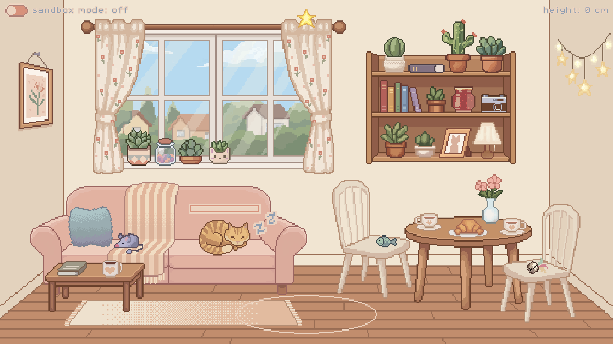
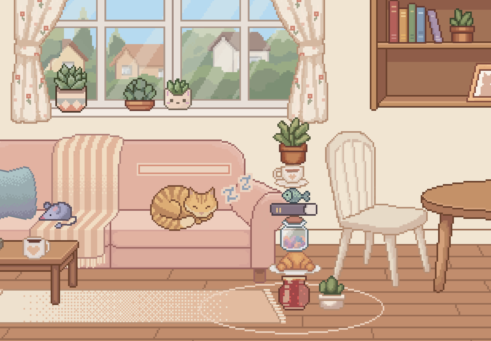
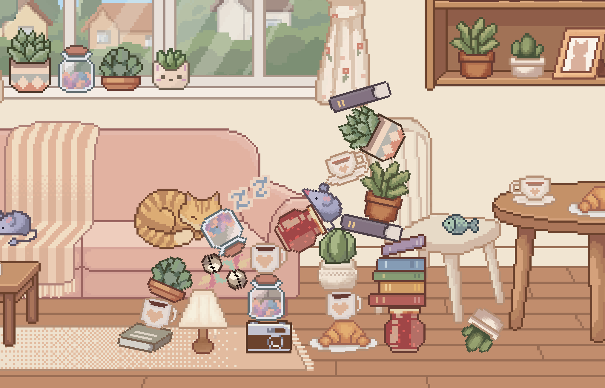

# 🐱 Tiptoe Tower

A cozy little stealth-stacking game — build a tower out of household junk tall enough to reach the star, **without waking the sleeping cat**. 🌙

> A small personal project made just for fun — practicing pixel art and learning Godot. No big ambitions here, just vibes. ✨



---

## 🎮 How to play

- 🖱️ **Drag** items from the shelves, table and sofa into the chalk circle to stack your tower.
- 🔄 **Right-click** (or hold **R**) while dragging to rotate an item.
- 📏 Build the tower up to the **star** to win.
- 🔊 Every drop makes noise — fill the meter too much and the cat wakes up. Game over!
- 🍶 Glass items *(cups, jars, vase)* make a distinct clink when they land — handle with care.

## 🧩 Game modes

| Mode | What happens |
|---|---|
| 🟦 **Sandbox** | Infinite items, no consequences — just mess around and build. |
| 🟥 **Challenge** | Limited items, real stakes — wake the cat and it's over. |

Toggle between them any time with the switch in the top-left corner. 🔀

## 📸 Screenshots

<table>
<tr>
<td width="50%">

**Challenge mode** — building carefully


</td>
<td width="50%">

**Sandbox mode** — no rules, just chaos


</td>
</tr>
</table>

## 🛠️ Built with

- [Godot 4.7](https://godotengine.org/) — engine
- GDScript
- Pixel font: [PixelOperator](https://www.dafont.com/pixel-operator.font) by Jayvee Enaguas
- Original art, sound effects and music 🎨🎵

## 📂 Project structure

```
scenes/       # the main room scene
scripts/      # gameplay logic (GDScript)
sprites/      # all pixel art
sounds/       # SFX
music/        # background music
fonts/        # UI font
shaders/      # transition/blur shader
```

## ✨ Status

Done! 🎉 Built iteratively with a *lot* of physics tuning. Not actively maintained, but feel free to poke around.

## 📜 License

- Code: [MIT](LICENSE)
- Art / sound / music: see [ASSETS_LICENSE.md](ASSETS_LICENSE.md) — free to use, even commercially, just don't resell the raw assets on their own.

---

Made with 💛 by magewade
